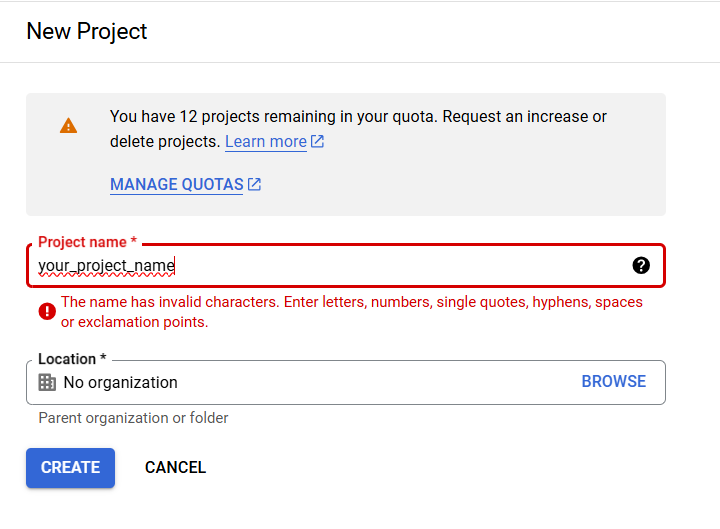
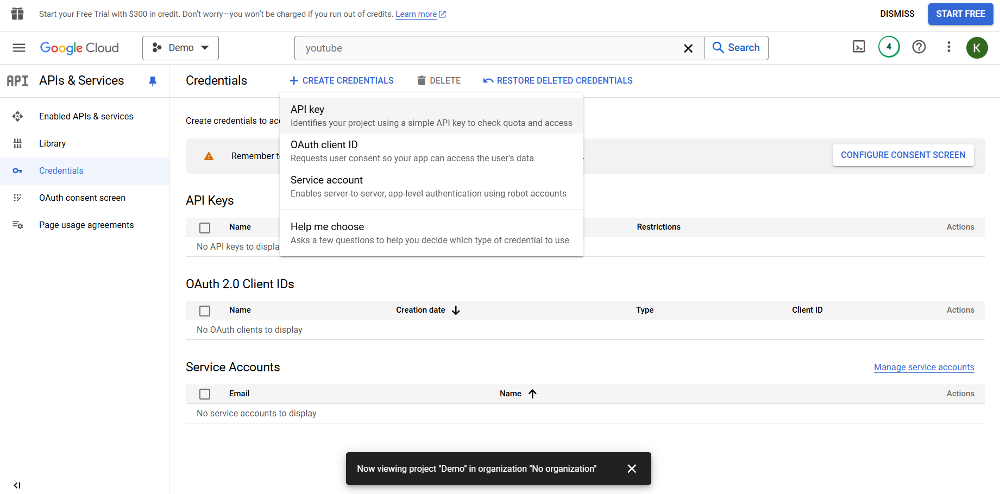
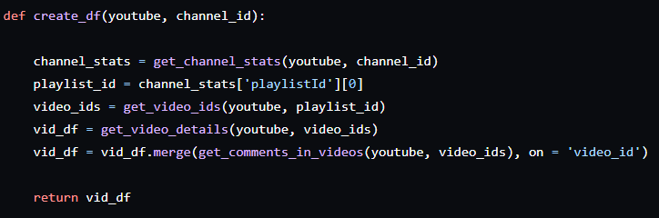
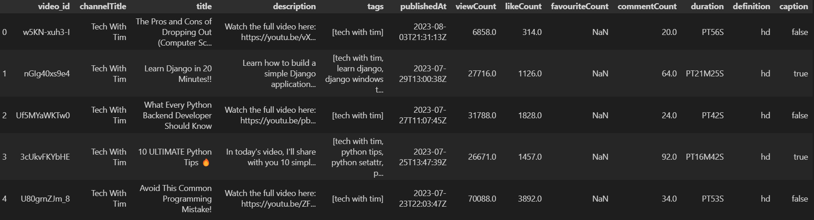
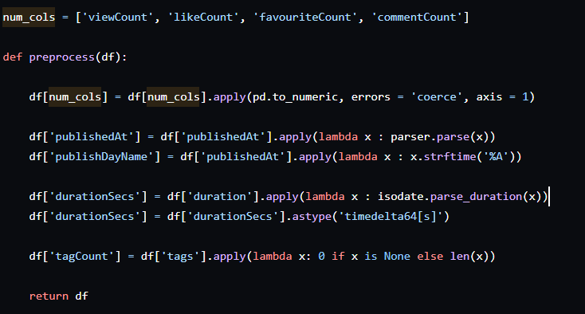

## Getting an API Key 
All of these steps have been explained in the official documentation of YouTube Data vs API [Python Quickstart  |  YouTube Data API  |  Google for Developers](https://developers.google.com/youtube/v3/quickstart/python).

Log on to [https://console.cloud.google.com](https://console.cloud.google.com/), click on the ‘Select a project’ button and then create a ‘New Project’.

  

                                        

After hitting create, select this project from the ‘Select a project’ button on the cloud console. Now look for youTube Data API v3, and click ‘enable’. This should take you to a page where you can see the YouTube API in the Enabled APIs & services section. In the ‘credentials’ section, click ‘+ CREATE CREDENTIALS’ and select ‘API Key’.

**API keys are confidential, so do not share.**

  

                                                                      

Once you get the key, it’ll be visible under the API Keys section in the above screen, you can click, copy and use.

Now, run the following command in your terminal, to be able to work with this API with python.

  

                                        

## Collect Data & Preprocess

  

      

This is the structure to create a dataframe like so:

  

  

  

  

We first convert columns with numerical data to the appropriate numeric data type. Next, we ensure the published date and time of each video are in the correct format and extract the day of the week. Similarly, we parse the video duration, converting it to seconds and setting it to the proper data type. Finally, we determine the number of tags each video has.

*This entire segment has been explained brilliantly by Thu Vu on her channel, so do check out the video : https://youtu.be/D56_Cx36oGY?si=miUZoZtUF0P5g145.*

I extend this project by creating a Streamlit Dashboard in the next blog. I hope you love it as much as I do! 😄🌟🚀
