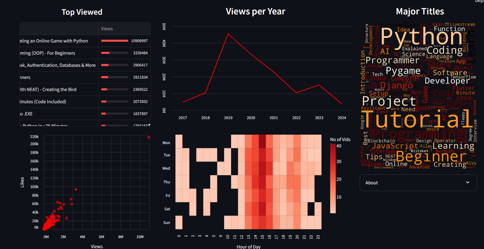
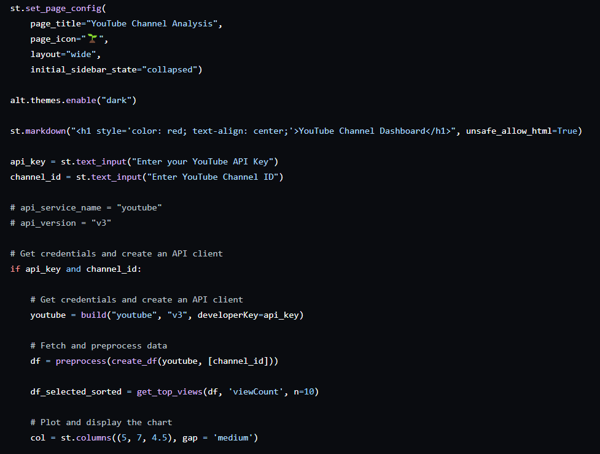
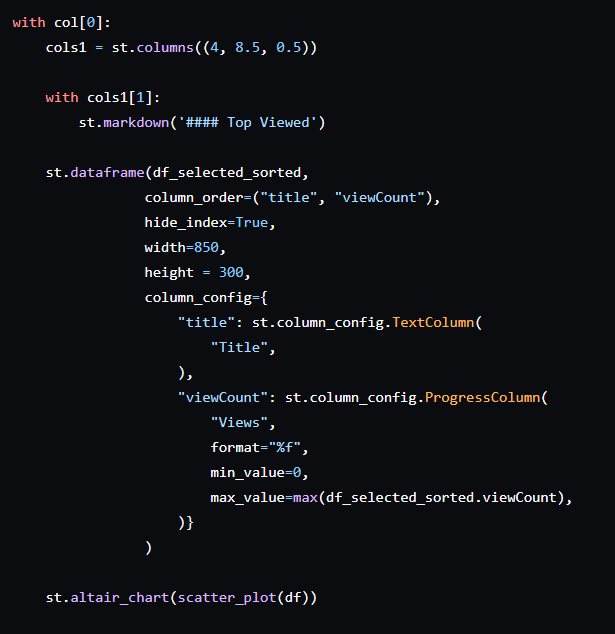
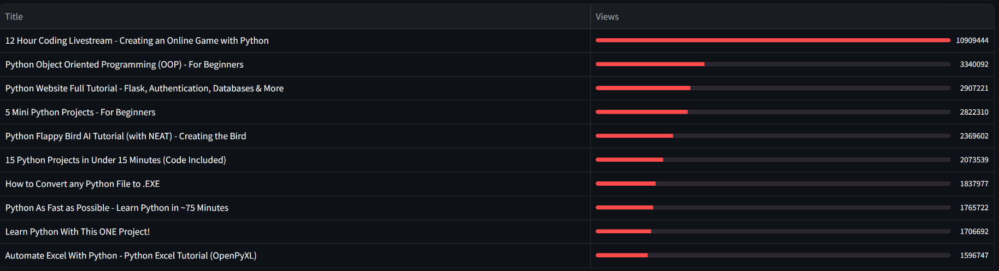
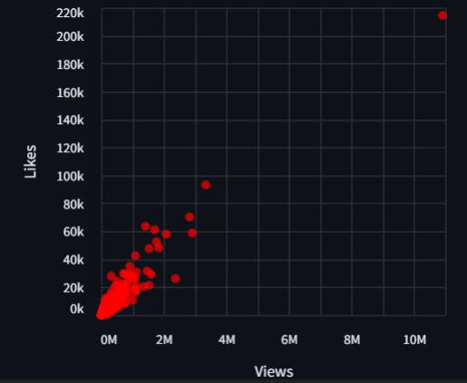
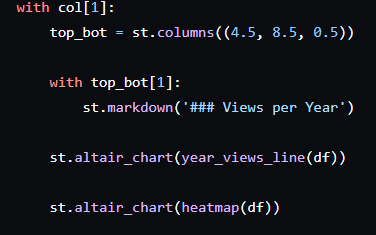
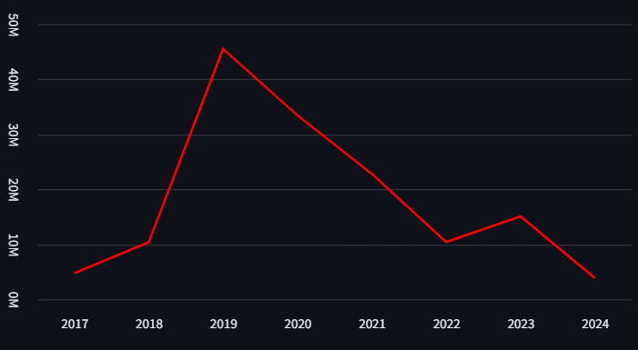
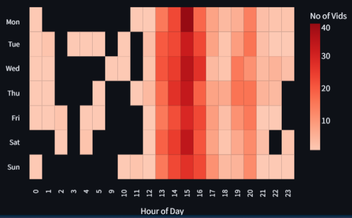
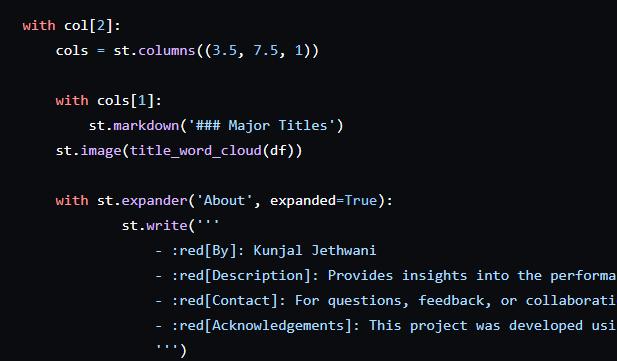
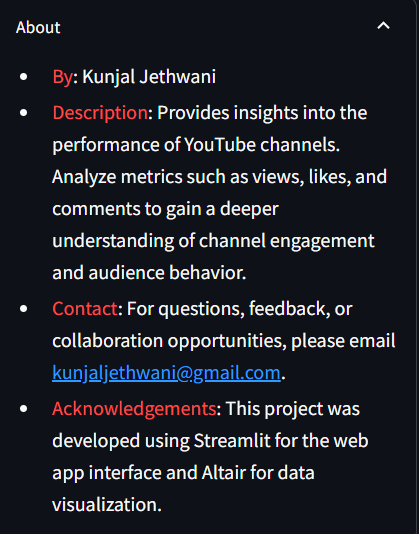

# Creating the Dashboard

  

## Initial Settings

  

When you visit a webpage, there’s a specific name associated with it, and an icon too (a compact version of the name; for when you have a lot of tabs open). So that’s what the first two parameters in st.config() are for. Next, we have layout and how we want the sidebar to be, when the webpage is opened. More details on https://docs.streamlit.io/develop/api-reference/configuration/st.set_page_config.

Next, we set the theme using the altair library and specify a title for the page.

Okay, having done the initial settings, let’s move on to creating the original dataset.

First we get the API key from the user (no we can’t use our own key every time since it’s risky and every key has a limited quota; for better user experience, we could make it optional for the user to give an API key, so if the user enters an API key, it’s used, else we use our own). Also, we want the user to enter the YouTube channel ID of the channel they want to see a dashboard of. 

<aside>
💡 Extracting the YouTube channel ID of a channel is simple. Go to the homepage of the channel, right-click, and select ‘View Page Source’. Now, do a page search for ‘channel_id’. You should find it in one of the last few references, enclosed in an `href` attribute within a tag, such as:

href="https://www.youtube.com/feeds/videos.xmlchannel_id=ugottagetthispart"

</aside>

Once the API key and channel ID have been received, we create an API client (a tool to use APIs easily), and create our dataframe using the functions discussed earlier. I’ve also created the top views table now itself, you could create it later, right before displaying it (it’s a simple function to sort and get the top n viewed videos, find it in plots.py). 

 Also, we want our dashboard to be laid out in three distinct columns, so we set the relative widths for those. Now this isn’t fixed, you could experiment and see which one suits your choice of charts better. 

## COLUMN 1 - Top Viewed Table & Scatter plot :

  

  

This table gives the top performing video titles along with their corresponding view count.

  

This chart shows us how the views and likes are related to each other. The direct relation is positive as views and likes grow together, however, causality isn't certain.

## Column 2 - Views per Year Line Chart & Heatmap :

  

  

This shows us how the channel viewership has grown over the years. We see a pick at around 2019-20, which is probably due to COVID 19, which saw a surge in digital content consumption, especially technology & education related, worldwide.

  

Heatmap gives us an idea of the number of video uploads on different hours of the various days of week.

## Column 3 - Word Cloud & Info Box :

  

  

Word clouds are a great way to get a glimpse of what the channel mostly is about, moreover, it could be used to identify user sentiment, if made with comments.

  

This information box is optional, but I thought it just adds to the feel of the project 😄.
